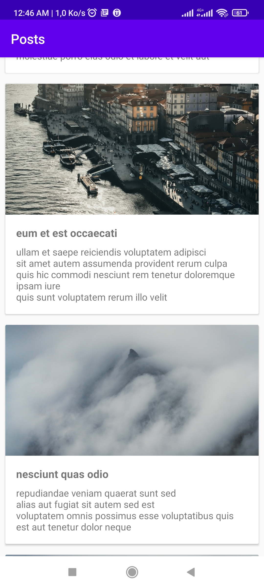
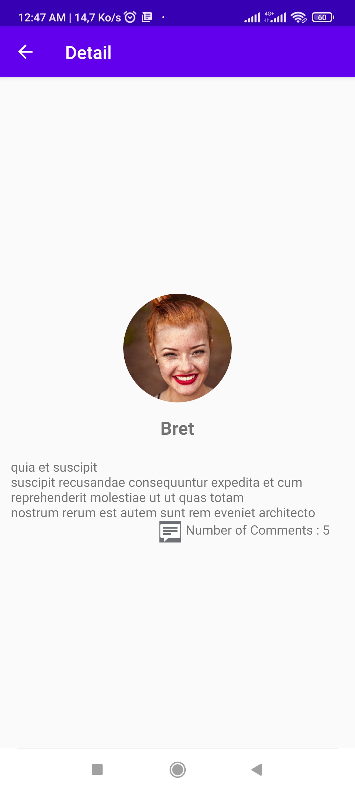
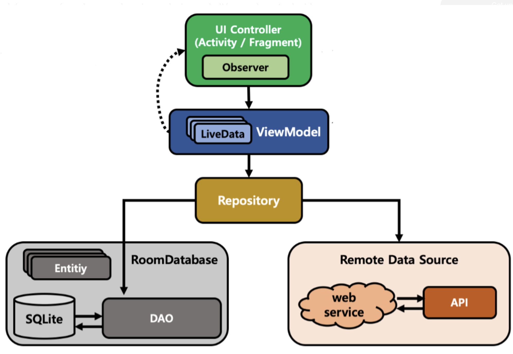

# 📱 Mobile Demo Project : Posts

---

This app is a sample mobile  application  for android device

## Description

---

The application displays a list of posts and have two screens.

### Post Screen

This screen displays a list of post get from an API  : [http://jsonplaceholder.typicode.com/posts](http://jsonplaceholder.typicode.com/posts)

### Detail Screen

Detail screen displays a post’s details :

- it's author
- it's description
- it's number of comments

The following API is used :

- [http://jsonplaceholder.typicode.com/comments](http://jsonplaceholder.typicode.com/comments)
- [http://jsonplaceholder.typicode.com/users](http://jsonplaceholder.typicode.com/users)

## Screenshots

---

## Architecture

---

The architecture that I use is MVVM

### Data source

1. **The remote data :**

Data is collecting from an API

1. **The local data**
- SQLite is the local data source. Each table is represented by entity.
- Room is an abstraction layer over SQLite that allows us to have quick and efficient access to the sqlite database
- DAO or Domain Access Object allows us to make queries to the Room Database

### **Repository**

Is where we get data and define the source of truth of our data.

Two cases :

- ✅ **There is internet connection**  : We get data first from the remote source and we cached them in the room database calling DAO functions
- ❌ **There is no connection :** Data is collected from cached data early store in the local  room database

### ViewModel

Store data for the UI layer

### UI Controller

- Activity
- Adapter

## Third party libraries

---

- **Glide** for image loading
- **Hilt**: for dependency injection
- **Kotlin Coroutines** for managing background threads with simplified code and reducing needs for callbacks

## Requirements

---

- Android Studio Arctic Fox | **2020.3.1**  or higher
- Minimun android SDK version  : **21**
- Target android  SDK version :  **29**

## **Getting Started**

---

This project uses the Gradle build system. To build this project, use the `gradlew build` command or use "Import Project" in Android Studio.

To build and run your app, follow these steps:

1. In the toolbar, select your app from the run configurations drop-down menu.
2. From the target device drop-down menu, select the device that you want to run your app on.

   

   If you don't have any devices configured, then you need to either [connect a device via USB](https://developer.android.com/studio/run/device#connect) or [create an AVD](https://developer.android.com/studio/run/managing-avds#createavd) to use the [Android Emulator](https://developer.android.com/studio/run/emulator).

3. Click **Run** ▶️

[You can directly download the application here and install it on an android device](https://drive.google.com/file/d/1VswlqfXF1cEKwLT_Qw7rTAUMyL_euCLy/view?usp=sharing)